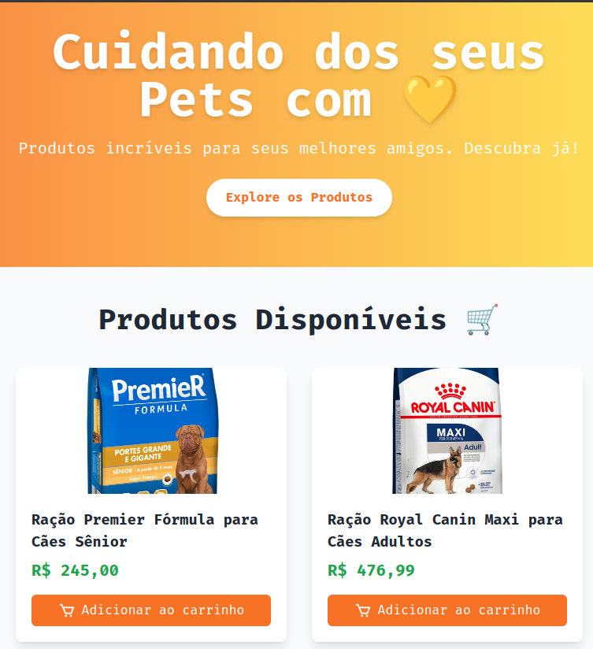

# Henrique Pet Shop



Este é um projeto simples de e-commerce voltado para um pet shop, desenvolvido com o intuito de estudar e aplicar conceitos de gerenciamento de estado no React utilizando Context API e useContext. O projeto também aborda o consumo de APIs, estilização com Tailwind CSS e práticas modernas de desenvolvimento front-end.

---

## Objetivo 
O principal objetivo foi compreender como usar o Context API para compartilhar dados entre componentes em uma aplicação React, sem a necessidade de bibliotecas externas como Redux. Durante o desenvolvimento, foram abordados conceitos fundamentais, incluindo:

-  Criação e configuração de contextos globais.
-  Compartilhamento e gerenciamento de dados no carrinho de compras.
-  Utilização de useContext para acessar os valores globais.
---

## Funcionalidades 🚀

-  Listagem de produtos consumidos de uma API.
-  Visualização detalhada de um produto em uma página individual.
-  Adicionar produtos ao carrinho com gerenciamento dinâmico de quantidade e preço.

---

## Como Executar o Projeto

1. Clone o repositório:  
   ```bash
   git clone git@github.com:henriquedevop/henriquePetShop.git
   ```
2. Navegue até o diretório do projeto::  
   ```bash
   cd henriquecommerce
   ```
3. Instale as dependências:  
   ```bash
   npm install
   ```
4. Inicie o servidor de desenvolvimento:  
   ```bash
   npm run dev
   ```

## Tecnologias Utilizadas ⚙️
- **React**  
- **TypeScript**  
- **Tailwind CSS**  

## Autor
Desenvolvido por [Henrique Devop](https://github.com/henriquedevop)